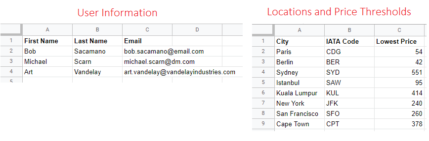

# Flight Club Project

APIs used:
- [Tequila by Kiwi](https://tequila.kiwi.com/) (for flight search and prices tracking)
- [Twilio](https://www.twilio.com/messaging/sms) (for SMS message delivery)
- [Sheety](https://sheety.co/)  (for reading and writing Google Sheets data in Python)

In this project, users who sign up to the mailing list using the 
'email_collect.py' file are notified by email and text message when 
the price of a round trip flight to any user-specified location is below
a user-specified price threshold within the next 6 months. 

The location (city name), associated (airport) IATA code, and price are 
individual columns on a Google sheet, which is converted into a 
REST API using the 'Sheety' API. 

The Flight Search API reads the locations and thresholds and subsequently
notifies the users with all the relevant details.

This includes the link for immediate booking...

...which is often lower than flight deals found using Google Flights 
(for example) with the same travel information.

